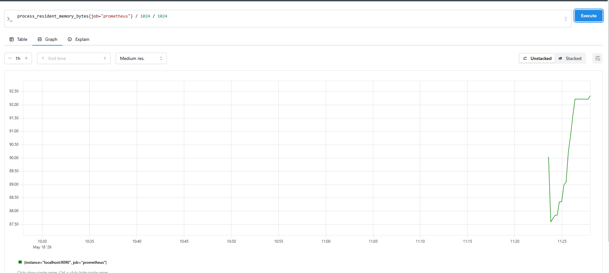
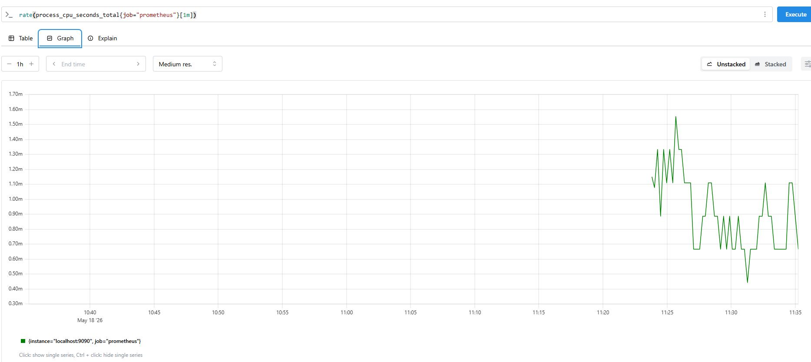

# telemetry-lemoncode-06

#Ejercicio 1

```docker
docker run -d `--name prometheus ` -p 9090:9090 ` -v "${PWD}/prometheus.yml:/etc/prometheus/prometheus.yml" `prom/prometheus
```


```PromQL
process_resident_memory_bytes{job="prometheus"} / 1024 / 1024
rate(process_cpu_seconds_total{job="prometheus"}[1m])
```

