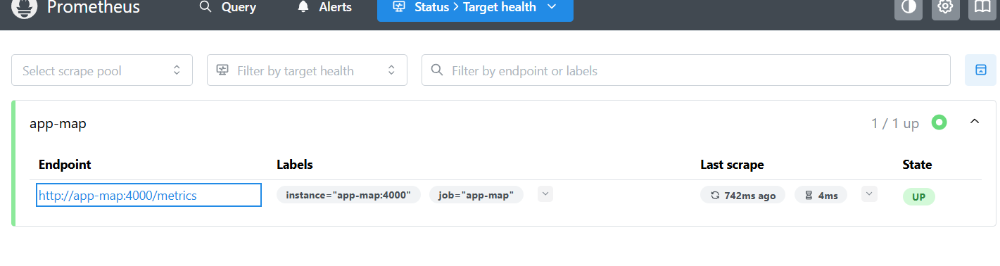
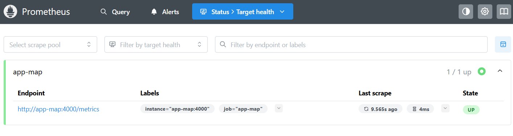
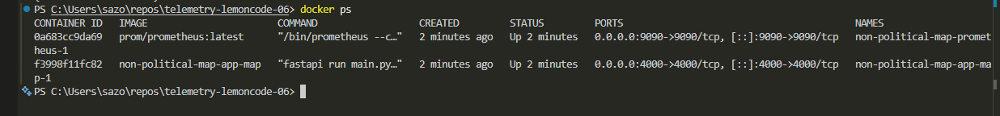
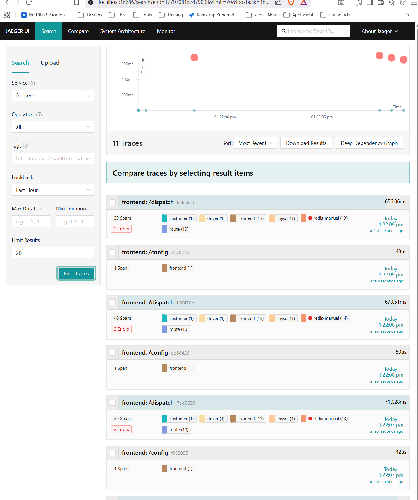

# telemetry-lemoncode-06

## Ejercicio 1 — Prometheus en local

```bash
docker run -d `
  --name prometheus `
  -p 9090:9090 `
  -v "${PWD}/prometheus.yml:/etc/prometheus/prometheus.yml" `
  prom/prometheus
```

**Queries PromQL ejecutadas:**

```promql
process_resident_memory_bytes{job="prometheus"} / 1024 / 1024
rate(process_cpu_seconds_total{job="prometheus"}[1m])
```


---

## Ejercicio 2 — Exporters, Recording Rules y Alert Rules

Ver [Ejercicio2.md](Ejercicio2.md)

---

## Ejercicio 3 — Loki startup folder

Ver [Ejercicio-3](Ejercicio-3/)

---

## Ejercicio 4 — Estructura de una traza en Jaeger

Ver [Ejercicio-4](Ejercicio-4/)

---

## Ejercicio 5 — Desafíos

### 5.1 — Docker Compose: Prometheus + Python App





